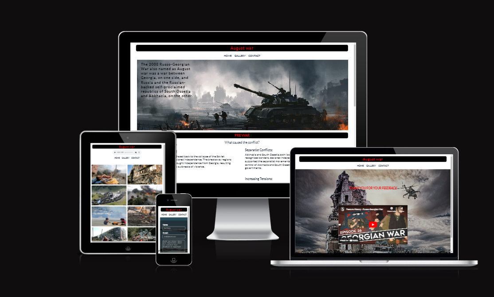
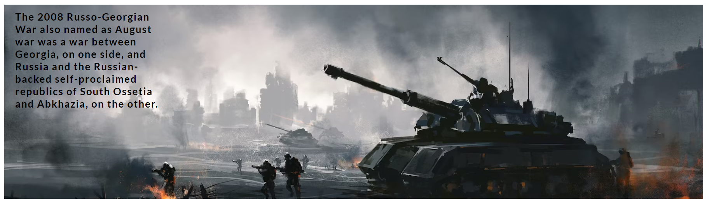
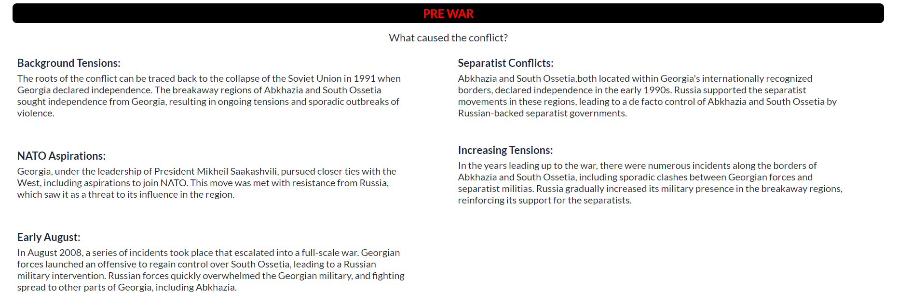
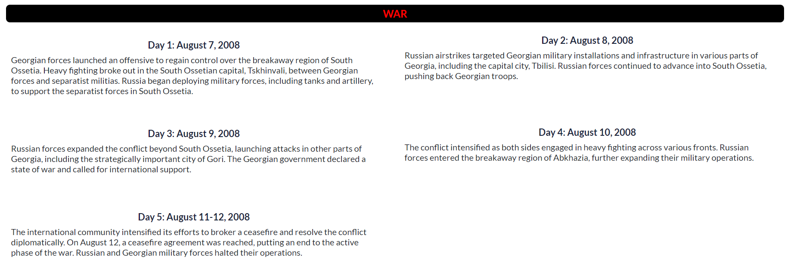
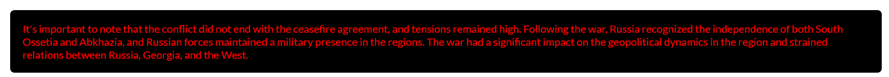
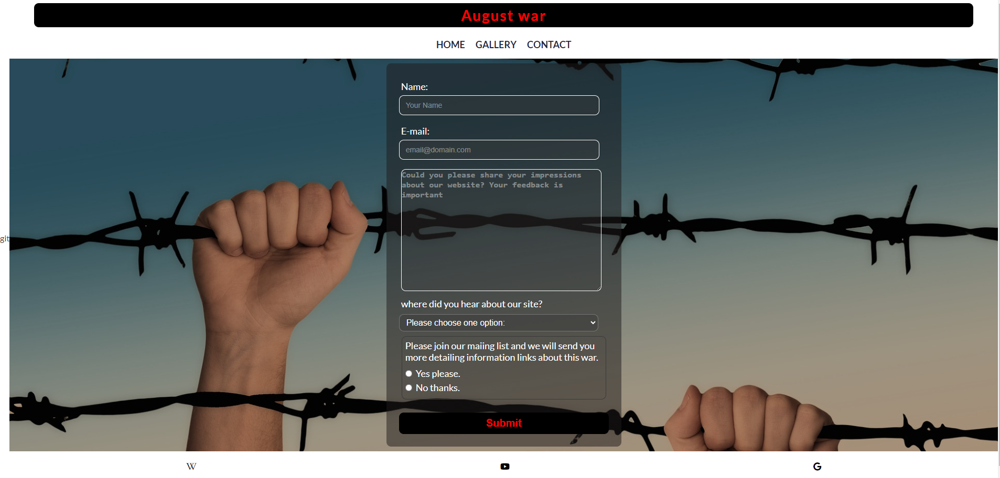
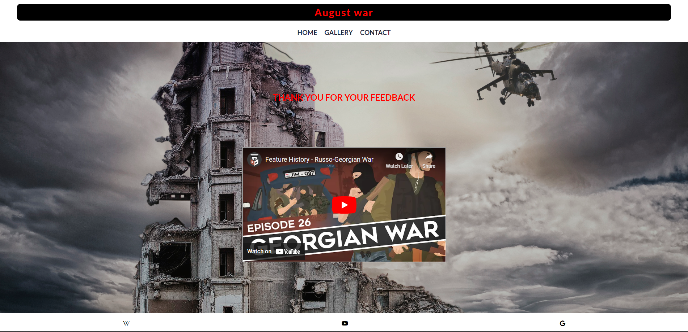

# **Russo-Georgian war**

## Introduction

I have decided to create an informational website on a significant topic for me, in order to provide more people with information about the events in Georgia during the 2008 war. The website is also named appropriately: russo-georgian-war.The site will be targeted toward people who are interested to get relevant itformation about this war.

## Planning stage

## target audiences:

- Users with general interest about August war.
- Users who have never heard about August war
- Users who have heard about August war but would like to get more information about it.

## Site Aim:

- to give information to the user about the war.
- To offer the user a way to contact the site author for further info or discussion.
- user to see the images captured during the time of the war.

## User:

- As a user ,I want to navigate the page to find what i require easily.
- User should have the feeling to know more about the subject when leaving each page.
- User should be able to navigate to free resources easily.
- User should be able to to reach out and connect to experience the subject matter on a deeper level.

### Features

### **Navigation Bar**

the full responsive navigation bar includes links to the Home page, Gallery and contact page .
This section will allow the user to easily navigate from page to page across all devices without having to revert back to the previous page via the ‘back’ button.

### **Hero-image**

The landing includes a photograph with text on it to allow the user to Create a general overview about what the website is.
This section introduces the user to website with an eye catching war-image to grab their attention.

### **Pre-war**

section-1 will allow the user to gain insights about the pre-war situation in Georgia.
They will have the idea to speculate on who initiated the war and how it began.

### **War**

Section-2 provides the user with detailed information to better understand how events unfolded during the turbulent period of the war.They will receive a brief description of each day of the five-day war.

### **Last Section**

This section gives to the user an overview of the situation following a conflict that involved Russia, Georgia, and the regions of South Ossetia and Abkhazia.

### **Footer**

The footer section includes links to the relevant sites for this.(its wikipedia, google and youtube). The links will open to a new tab to allow easy navigation for the user.
The footer is valuable to the user as it encourages them to get more information about August-war.

### **Gallery Page**

The gallery will provide the user with images captured during the August war and also While viewing the images, listen to music if they want.
This section is valuable to the user as they will have more realistic imagination about the war.

### **Contact Page**

- This page will allow the user to send their feelings and impressions about the information they get ,Express their thoughts about the war.
- Also user will be able specify if they would like to get more infomation about the war or not.
- The user will be asked to submit their full name and email address..
- The contact form is valuable to the user as it gives them chance to know more about the war.
  

### **Feedback Page**

After submiting infotmation from contact page another feedback page will open .
this site contains thanks message for user for submiting feedback and also let user to watch youtube video about Russo-georgian war.both submit and feedback pages have eye-catching bakcgdound images.

## **Testing**

- I checked this project using DevTools' device toolbar and confirmed that it looks responsive on all screen types.
- all sections are readeble and easy to understand.
- The site works in different browsers:Microsoft edge,Firefox,Chrome,Safari.
- I tested that you can play music on gallery page.
- i Tested that youtube video link works on feedback page.
- I confirm that contact form works without eny problem.

## bugs

### solved bags

When I was testing my project, I noticed a few bugs:

1. Gallery images had different heights on the desktop version. To fix this bug, I adjusted the grid-template-columns property. I set it to a value that allows columns to automatically adjust to the available space, with each column's width being at least 20% of the container's width and expanding to take up more space if available (repeat(auto-fill, minmax(20%, 1fr)).
2. In section 3 (the "War" section), the right grid elements were moving upwards as the screen size increased. To address this issue, I set the align-items property to "start."

3. On the contact page, when the screen size was under 300px, the form section was vertically overflowing. To resolve this issue, I centered the form section using flex

### unfixed bugs

- no unfixed bugs

## **Validator Testing**

- HTML-No errors were found when passing through the official W3C validator.
- CSS-No errors were found when passing through the official (Jigsaw) validator.

## Design

### Typography

- I used Lato - for the project.

### Color Scheme

On my website, the main theme prominently features black and red colors, much like a symbol of conflict.
I create color palette using [Cooloers](https://coolors.co).

## **Deployment**

The site was deployed to GitHub pages. The steps to deploy are as follows:

1. In the GitHub repository, go to the Settings tab.(which locates at top right of the repository)
2. scroll down to the github pages section.
3. we select the branch in the source section.(main) and save it.
4. In few moments the page will be automatically refreshed and will generate a URL .

The live link can be found here - https://tamariam.github.io/Russo-Georgian-War/

## credits

### General Reference

- I relied on W3schools,stack overflow and MDN for general references throughout the project.

### **Content**

- The text for the Home page was taken from [Russo-Georgian War Wikipedia Article](https://en.wikipedia.org/wiki/Russo-Georgian_War)
- The icons in the footer were taken from [fontawasome](https://fontawesome.com/.)
- fonts imported from - [Google fonts](https://fonts.google.com/)

### **Media**

- The photos used on the home contact and feedback page are from This [random-war-pictures](https://pixabay.com/images/search/war/) site.
- The images used for the gallery page were taken from [google picures](https://www.google.com/search?sca_esv=556766949&sxsrf=AB5stBgiZCiA-vW2bX-Gk4x-l7wgnilWAQ:1692024454398&q=russo+georgian+war&tbm=isch&source=lnms&sa=X&ved=2ahUKEwj0wbikstyAAxWMXUEAHdgICyMQ0pQJegQICxAB&biw=1920&bih=923&dpr=1) site.
